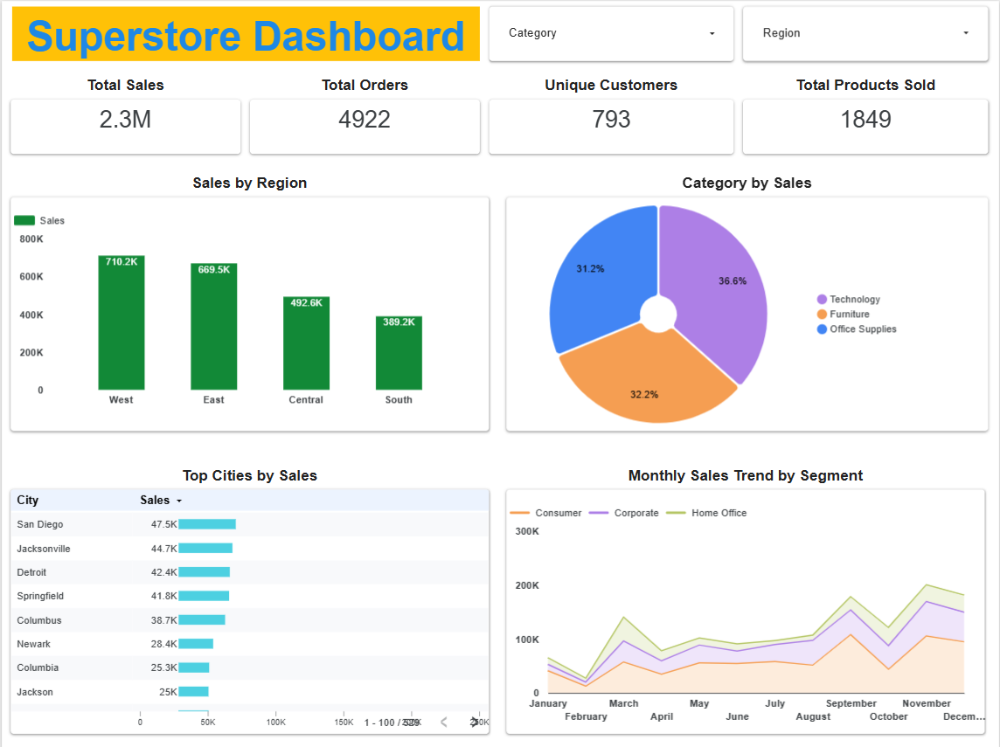

# 📊 Superstore Sales Dashboard

This project is an interactive sales dashboard built using **Looker Studio** and **Google Sheets**, based on the popular Superstore dataset. The dashboard offers valuable insights into regional performance, category-wise trends, customer behavior, and sales patterns over time.

---

## 📁 Dataset

- `superstore.csv`: Contains historical sales data with fields like:
  - Order Date
  - Ship Mode
  - Customer Segment
  - Region, City, State
  - Category, Sub-Category
  - Sales Amount

---

## 📌 Features

- 🔹 KPI Cards for Total Sales, Orders, Unique Customers, and Products Sold
- 📍 Bar chart showing **Sales by Region**
- 🧁 Donut chart for **Category-wise Sales Share**
- 🗂️ Table of **Top Performing Cities**
- 📈 Area chart for **Monthly Sales Trend by Segment**
- 📂 Filter controls for **Category** and **Region**

---

## 🛠 Tools Used

- **Looker Studio** for visualization
- **Google Sheets** for data connection
- **GitHub** for project hosting

---

## 🏷 Topics

`Data Visualization` `Looker Studio` `Google Sheets` `Superstore Dataset` `Sales Analysis` `Dashboard Project` `Business Intelligence`

---

## 🚀 How to Use

1. Clone this repo
2. Open the `superstore.csv` in Google Sheets
3. Connect it to Looker Studio
4. Rebuild or explore the dashboard with your own style

---

## 📧 Contact

If you like this project or have suggestions, feel free to connect!

